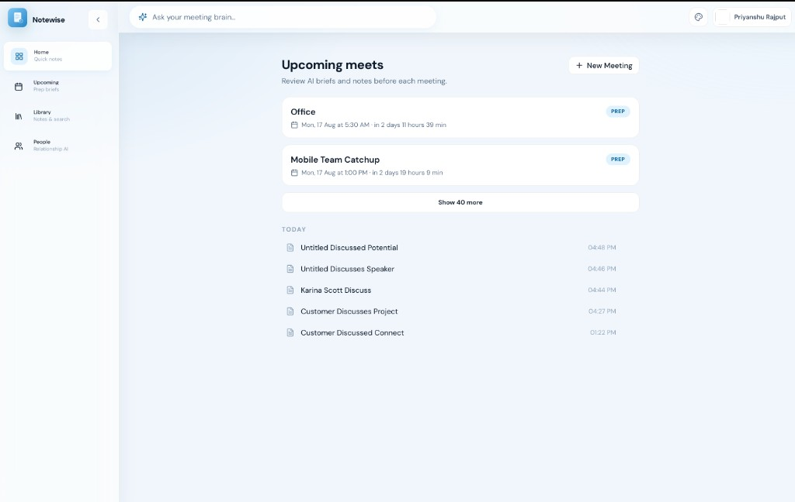
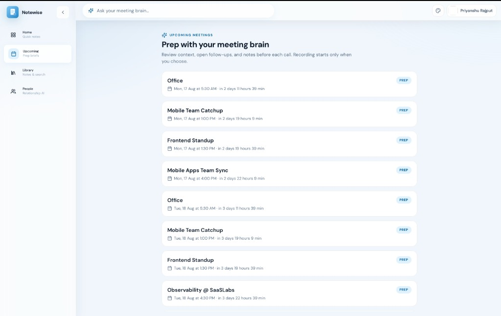
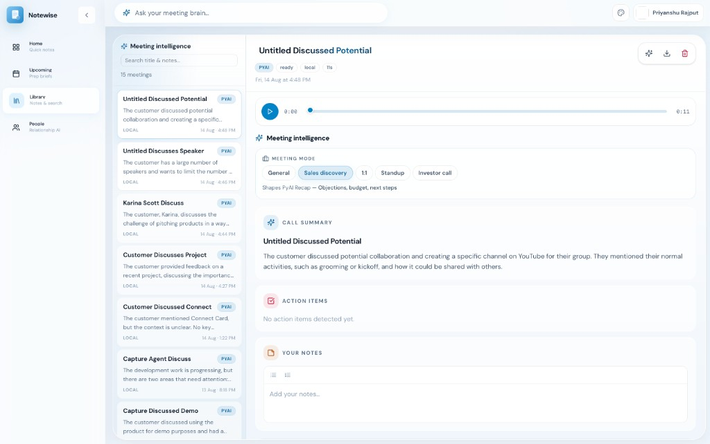
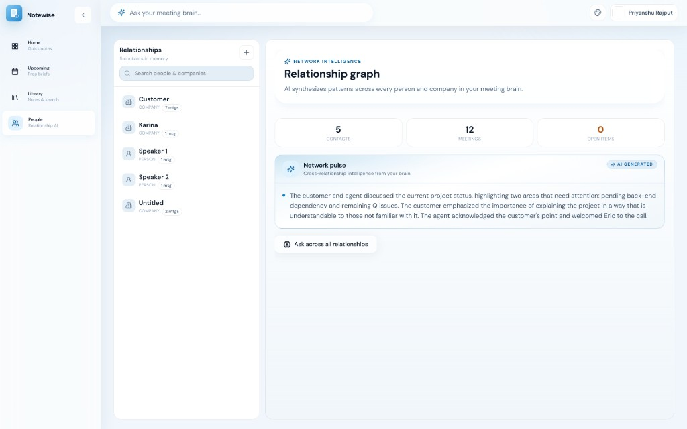

# Notewise

**AI meeting notes that stay on your machine.**

Notewise captures conversations without a bot joining the call, turns them into structured notes with transcript receipts, and builds memory across people and meetings — all powered by a local gateway on your Mac.

🌐 **[Visit Website](https://notewise-website.vercel.app/)** · MIT licensed · [Privacy & trust](docs/USAGE.md#trust--privacy) · [Full usage guide](docs/USAGE.md)

---

## Why Notewise

- **No meeting bot** — record from your mic and system audio; nothing joins Zoom or Meet.
- **Notes you can trust** — claims link to transcript lines; unverified statements are dropped.
- **Memory that compounds** — people, commitments, and context carry forward across calls.
- **Local by default** — audio and data stay on disk; PyAI runs through your own gateway.

---

## Screenshots

### Home — quick notes and upcoming meets



### Upcoming — prep briefs before each call



### Library — searchable meeting intelligence



### People — relationship graph and network pulse



---

## Setup

### 1. Web Setup (Development)

Run Notewise in your browser with the local AI gateway.

**Requirements:**

- macOS (recommended)
- Node 20+
- Python 3.9+
- pnpm
- [PyAI API key](https://api.pyai.com)

**Installation:**

```bash
# Install dependencies and create .env files
make setup

# Start gateway + web app
make dev
```

Open **http://127.0.0.1:5173**, sign in, accept recording consent, and start a capture.

**Verify setup:**

```bash
make doctor   # Check Python, Node, API key, and permissions
```

**Try without recording:** Library → **Import 5 sample calls**

**Alternative commands:**

```bash
# Two terminals (optional)
make run    # Terminal A — AI gateway (http://127.0.0.1:3002)
make web    # Terminal B — Web app (http://127.0.0.1:5173)

# Or use pnpm directly
pnpm dev          # Both gateway + web
pnpm dev:gateway  # Gateway only
pnpm dev:web      # Web only
```

---

### 2. Desktop Setup (Production)

For daily use, install the native macOS app with menu bar tray and system-audio capture.

#### Option A: Download Pre-built DMG

**1. Install the Desktop App:**

Download the latest DMG: **[Notewise_0.1.0_aarch64.dmg](apps/website/public/Notewise_0.1.0_aarch64.dmg)**

```bash
# Open the DMG and drag Notewise.app to Applications
# Then remove quarantine attribute (required for unsigned builds)
xattr -cr /Applications/Notewise.app
```

Launch Notewise from Applications or Spotlight (Cmd+Space → "Notewise")

**2. Run the Backend Gateway:**

The desktop app needs the AI gateway running in the background.

```bash
# Install dependencies (first time only)
make setup

# Start the gateway
make run
```

Gateway will run at http://127.0.0.1:3002

**Note:** The desktop app will auto-connect to the local gateway. Keep the terminal running while using Notewise.

---

#### Option B: Build DMG from Source

**1. Build the DMG:**

```bash
# Install dependencies (first time only)
make setup

# Build DMG installer
make build-dmg
```

DMG will be created at: `apps/desktop/src-tauri/target/release/bundle/dmg/Notewise_0.1.0_aarch64.dmg`

**2. Install and Remove Quarantine:**

```bash
# Install from the built DMG
# Then remove quarantine attribute
xattr -cr /Applications/Notewise.app
```

**3. Run the Backend Gateway:**

```bash
# Start the gateway
make run
```

Gateway will run at http://127.0.0.1:3002

---

**Development mode** (no DMG needed):

```bash
make desktop  # Runs app + gateway together
```

→ [Desktop Documentation](apps/desktop/README.md)

---

## Features

|              |                                                                                                  |
| ------------ | ------------------------------------------------------------------------------------------------ |
| **Capture**  | Live transcription, meeting modes (General, Sales, 1:1, Standup, Investor), optional people tags |
| **Notes**    | Executive summary, takeaways, action items — each tied to the transcript                         |
| **Library**  | Search every meeting on disk; regenerate notes in a different mode                               |
| **People**   | Relationship graph, briefs, commitments, and objections over time                                |
| **Calendar** | Google Calendar sync, prep briefs, and upcoming-call reminders                                   |
| **Ask**      | Q&A across your library with citations (Meeting brain, voice shortcut)                           |

---

## Configuration

`make setup` creates `.env` files from templates. Add your API keys before running.

**Required:**

- `services/pyai-gateway/.env` — PyAI API key, Google OAuth credentials, JWT secret

**Optional:**

- `apps/web/.env` — Gateway proxy target (defaults work for local dev)
- `apps/website/.env.local` — DMG/GitHub URLs (marketing site only)

**Custom meeting modes:** Edit `modes/*.yaml` then run `make upload-packs`

⚠️ Never commit `.env` files or secrets to version control.

---

## Documentation

| Document                                                           | Description                                                       |
| ------------------------------------------------------------------ | ----------------------------------------------------------------- |
| **[docs/USAGE.md](docs/USAGE.md)**                                 | Complete guide — every screen, shortcut, and troubleshooting step |
| [services/pyai-gateway/README.md](services/pyai-gateway/README.md) | Gateway API and pipeline                                          |
| [apps/desktop/README.md](apps/desktop/README.md)                   | Tauri app, DMG build, installation                                |
| [apps/website/README.md](apps/website/README.md)                   | Marketing site and Vercel deploy                                  |

**Marketing site:**

- Live: https://notewise-website.vercel.app/
- Local: Run `make website` then visit http://localhost:5174

---

## License

MIT — audit the code, fork it, ship it.
